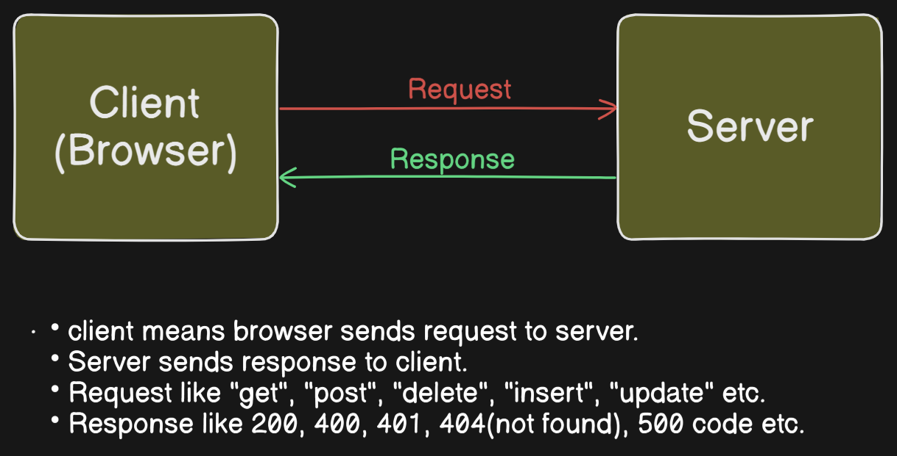

## Protocol
- Protocol means when data or request or response exchanged/transferred between browser and server meanwhile protocol is used to set rules or guidelines, that how data will be transferred between them.
- Protocol provides many types of protocol in order to transfered data in different ways such as "http","https","ftp","tcp/ip","websocket" and many more.
- protocol refers set of rules and guidelines that govern how things should be done or
  how system should communicate with each other.
- protocol is used for internal communication. 

## HTTP (Hyper Text Transfer Protocol)
- HTTP means Hyper Text Transfer Protocol.
- protocol is used to transfer hyper text.
- HTTP is used by the web to transfer data between browser and web server. When you type a url in browser, an HTTP request sent to the server, and the server sends the response with the appropriate data.(like a webpage) 
- http is a stateless protocol.
- stateless means suppose you are watching youtube video during watching video you
  paused video for a while and after some time again you played video but that vieo 
  didnot play since paused so it means it has not maintained state. so http is stateless whereas https maintained state.
- "session" stored 'state' between frontend and backend.
- "cookie" means information.  
- http header sends information like "cilent", "browser information", "date & time".
- HTTP version are - HTTP1, HTTP1.1, HTTP2, HTTP3(current version)
- When you visit a website, your browser uses HTTP (Hypertext Transfer Protocol) or HTTPS (HTTP Secure), which is built on top of TCP.
- TCP ensures that the webpage data (images, text, etc.) is delivered correctly and in the right order.
- If any data is lost during transmission, TCP will request the missing parts again until the full page loads properly.

## Http2
- http means http2.(http1.1 is a fallback(backup) and still it is used)
- http2 contains http1.1
- it uses compression.
- it uses multiplexing.(many files at same time)
- it uses encryption

## HTTPS (Hyper Text Transfer Protocol Secure)
- HTTPS is secure version of HTTP, it encrypts data to protect it from being intercepted by malicious actors during transmission.
- Using HTTPS the data gets encrypted/locked only client(browser) and server can know what type of data is transferring and others can't know so this ensure that data is confidential and protected.(like whatsapp message or gmail etc.)
- When you connect to a website using HTTPS, the connection is encrypted using SSL/TLS (Secure Sockets Layer / Transport Layer Security). This means that anyone who intercepts the data (like hackers or third-party observers) cannot read the content because the data is encrypted and appears as unreadable gibberish.

## FTP (File Transfer Protocol)
- FTP is used for transferring file such as .mp3/.mp4/.pdf/.xls/.docs/.png/.jpeg etc. between a client(like a browser or ftp client) and server.
- It is often used for uploading file on web server or downloading file from server.
- FTP (File Transfer Protocol) is used to transfer files between computers over a network.
-   TCP ensures that the files are transferred reliably, correctly, and in order. If there’s any data corruption or loss, TCP will retransmit the packets.

## SMTP/POP3/IMAP
- When sending or receiving emails, SMTP (Simple Mail Transfer Protocol), POP3 (Post Office Protocol), or IMAP (Internet Message Access Protocol) rely on TCP for reliable data transmission.
- TCP ensures that the message content, attachments, and other parts of the email arrive safely and in the correct order.

## Websocket
- his allows for full-duplex communication channels over a single, long-lived connection between the client and the server, often used for real-time applications like chat or live updates.

## TCP/IP
- Transmission Control Protocol/Internet Protocol. is a set of communication protocols used to interconnect devices on the internet or a local network.
- It ensures that data is sent and received reliably and in the correct order. It manages the flow of data between devices, checking for errors, and resending lost or corrupted packets.
- TCP/IP refers to the combined use of both the Internet Protocol (IP) and Transmission Control Protocol (TCP) to enable communication over a network.
- IP handles where the data is going (addressing). IP means computer name.
- **for more details about TCP check 12-jan-2025 file**

## UDP
- UDP stands for User Datagram Protocol.
- **for more details about UDP check 12-jan-2025 file**

## Client(browser) & Server Architechture
- follow the diagram below.
- 👇How browser and server establish connection or how they communicate with each other?
- 👉Browser and Server both are software and both are running on separate computer.
- 👉At first setup TCP connection. or UDP connection or it could be any other connection.
- 👉Then TLS certificate(HTTPS) gets exchange.
- 👉send verb(get/post/delete/insert request) + URL + Data(Article) + header.
- 👉gets the response back with status code and data (like img, csv, text) 
- 👉Then eventually TCP connection is closed (stateless)    
- Server continuously reamin ON because user can perform any work at anytime as per his own choice, work like user can watch youtube video at anytime or user can order any product from any ecommerce site at any time so this ensures that youtube or amazon or whatsapp it runs on a server for this reason server remains ON at anytime.
 

### User Agent (Browser)
- It sends information to server from browser.

### URL
- URL means Uniform Resource Locator.
- Uniform - formally
- Resource - data
- Locator - location
- URL is a reference or address to access the resources (like webpage, image, file or api) over the internet.
- It specifies the location of the resource and how to retrieve it.

### DNS(Domain Name System Server)
- It points URL to IP.
- It like our mobile "contact" folder it holds all number along with name.

### Header
- It pass additional information/data (like meta data).

### Payload
- Payload is actual data.

### Cache Memory
- It is a temporary storage, it sotores the data in browser memory i.e. known as cache memory.
- Nice Example: 
- When you are logged in to Facebook or another application, your credentials (like username and password) are not stored in the browser cache. Instead:
- Session information or a secure token is stored in the browser's cookies or local storage.
- When you refresh the page or navigate to another part of the site, the browser sends this session token back to the server to prove you're logged in.
- The server then recognizes the session and grants access without needing to ask for your credentials again.
- **Key Points:**
- **Cache**: Used for non-sensitive, static assets like images, CSS, and JavaScript files.
- **Session Tokens / Cookies**: Store information like your logged-in session, enabling quick access without re-entering credentials.
- **Security**: Credentials like passwords are never stored in the browser cache, for security reasons.

