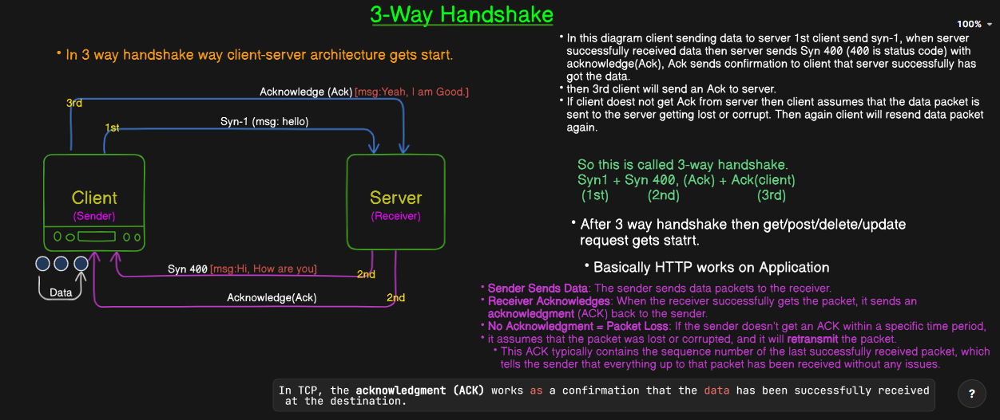

**Actually when data gets transfer from browser to server it uses OSI(Open System Interconnect) Model -**
- OSI Model uses 7 layer.
- These 7 layer together transfer the data from browser to server.

- #7 - Application layer -- Application layer handling these 5,6,7
- #6 - Presentation layer - Application layer handling these 5,6,7
- #5 - Session layer    -- Application layer handling these 5,6,7
- #4 - Transport layer  -- TCP / UDP protocol works on transport layer to transfer data.
- #3 - Network layer    -- doing Routing work, Routing IP Address.
- #2 - Data link        -- works on frames(like tcp frame/udp frame/header frame etc.)
                        -- Data link frame travel on physical layer using 0 or  1.
- #1 - Physical layer   -- works on Bits 0 or 1

- Follow diagram below

# TCP/IP (Transmission control protocol)
- TCP is used to send the data packets over the internet or computer networks.
- Before sending data, TCP establish a connection between sender and receiver. This is done using a process called 3-way-handshake.
- Only after the connection established data transfer gets begin.
- TCP ensures that the data you send reaches its destination accurately/reliably and in the correct order. It uses Acknowledgements(Acks) to confirm that data packets have arrived safely at the destination. 
- If a packet is lost or corrupted during transmission, then TCP will resend it.
- TCP/IP refers to the combined use of both the Internet Protocol (IP) and Transmission Control Protocol (TCP) to enable communication over a network.
- IP handles where the data is going (addressing). IP means computer name.
- TCP is used to transfer the data from browser to server.
- it is reliable, data does not get loss.
- Check 3-way handshake diagram below.

- TCP is used for applications that need reliable, error-free data delivery, such as web browsing, file transfers, email, and remote desktop connections.
- When you visit a website, your browser uses HTTP (Hypertext Transfer Protocol) or HTTPS (HTTP Secure), which is built on top of TCP.
- TCP ensures that the webpage data (images, text, etc.) is delivered correctly and in the right order.
- If any data is lost during transmission, TCP will request the missing parts again until the full page loads properly.

# UDP (User Datagram Protocol)
- UDP stands for User Datagram Protocol, UDP is the opposite of TCP protocol.
- UDP is used to send data in the form of small packets called datagram.
- UDP doesn't establish connection between sender and receiver before data transfer, also it doesn't follow the 3-way-handshake process.
- It simply sends the data packet directly to the destination. This makes it faster but less reliable.
- Once the data is sent, the sender does not wait for any acknowledgment (a reply) from the receiver to confirm that the data has been received successfully.
- This is different from TCP, where the receiver must acknowledge each packet, ensuring that data is delivered correctly.
- UDP does not guarantee the delivery of packets. Some packets might be lost on their way to the destination.
- There’s no mechanism to check if the packet is lost or corrupted.
- If reliability is needed, additional checks need to be implemented by the application itself.
- Since it doesn't have the overhead of connection establishment, acknowledgments, or error correction, UDP is faster than TCP.
- This is useful for applications where speed is crucial and some data loss is acceptable (like live video streaming or online gaming).
- UDP doesn’t ensure that packets arrive in the order they were sent.
- For example, if packets 1 and 2 are sent, but packet 2 arrives first and packet 1 arrives second, the application needs to handle the reordering, if needed.
- UDP is faster than TCP because 
  - it doesn't establish connection.
  - it is not reliable.
  - it doesn't follow the correct order.
- UDP protocol can used for like online gaming, video conferencing, or live streaming, where speed is more important than ensuring every packet arrives. Even if some data gets lost, it's better to keep the flow of information going. 

## Streaming Media (but sometimes not TCP)
- While UDP is often used for real-time streaming (since it’s faster), TCP can be used for streaming media (like movies or music) if the application requires high reliability and can handle slight delays.
- Example: When streaming a video from a service like YouTube, TCP may be used to ensure that the video data arrives without errors. However, for real-time streaming like live events, UDP might be preferred to reduce delay, even at the cost of occasional packet loss.

## Voice Over IP (VoIP) (but TCP is less common here)
- VoIP services like Skype or Zoom sometimes use TCP for establishing the initial connection or for signaling messages.
However, for transmitting voice data, UDP is often preferred due to the need for low-latency communication.
- Example: When you make a voice call over the internet, the signaling to establish the call (like ringing, connecting) might use TCP. Once the call starts, UDP is used to transmit the actual voice data because it’s faster and more efficient for real-time communication.

