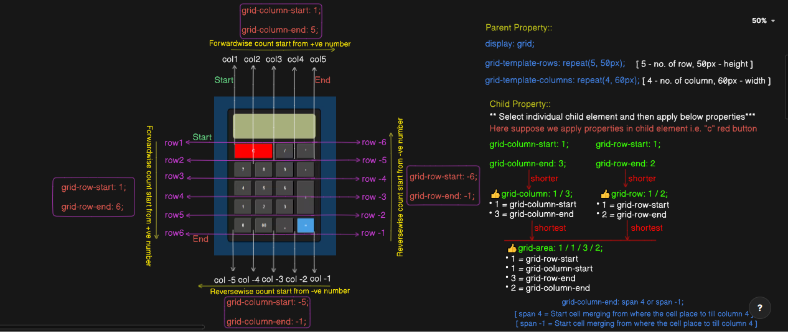

### 🎁display: inline/inline-block/block
display: inline/block/inline-block will work on individual element
         and also will work on when select multiple element.
```css
display: inline;
```

1️⃣"inline" re margin top & bottom property kamo kareni only margin left & right kamo kare. Whereas inline-block re margin top & bottom & left & right kamo kare.

2️⃣jetiki content size setiki width and height occupy karibo.        
            3️⃣ aou jetebele multiple element ku select kari ehi property apply karuchey
                    setebele sabu element gote line re heijibe aou width and height content size jaha setiki rahibo.  
                   4️⃣ jou element ku "inline" use karuchey sei element re jodi width and height size mention karajaichi,
                    but sei element ro content size jodi kam tahele sei content zize hinee nebo width and height neboni.
```css
display: inline-block;
```

1️⃣inline-block re margin top & bottom & left & right kamo kare.

2️⃣jetiki content size setiki width and height occupy karibo ya chada jodi extra width and height,
                           dia heichi tahele yeh content size anusarey width & height set heboni ethi element
                           ro width & height set hebo jou width and height dia heichi. 
                           
3️⃣jodi width and height dia heino thibo
                           ta hele content size re hinee width & height set heijibo.

4️⃣  aou jetebele multiple element ku select kari ehi property apply karuchey
                            setebele sabu element gote line re heijibe aou width and height content size jaha setiki rahibo,
                            jodi external width and height dia heichi tahele ehi property sehi external width and height ku set karibo.  
```css        
display: block;                            
```
1️⃣jodi width and height property dia heini tahele yeh full page width occupy karibo and height contect size jetiki setiki height occupy karibo,
                           aou yeh element gote line hinee full ocuupy karibo same line re other elment ku rahiba painee allow kariboni.                 
                           2️⃣jodi width and height property dia heichi tahele setiki width and height set hebo and single line re rahibo aou sei line re other element rahi paribeni


### 🎁FlexBox -- display: flex
Mainly flexbox works on child but we need to write property on parent.
```html
<div id="parent">
    <div>child1</div>
    <div>child2</div>
    <div>child3</div>
</div>
👉Here div #parent -- flexbox
👉div(child1,child2,child3) -- flex item
👉child1,child2,child3 -- content

<ul>
  <li>Box1</li>
  <li>Box2</li>
  <li>Box3</li>
</ul>
👉 here ul -- flexbox
👉 li      -- flex item
👉 Box1,Box2,Box3 -- content  
```

**Flexbox 'parent' property:**
- display: flex;
- justify-content: center/start/end/space-between/space-evenly/space-around etc..
- align-items: center/self-start/self-end etc..
- align-content: center/start/end/space-around/space-evenly/space-between etc..
- flex-wrap: wrap/no-wrap/wrap-reverse
- gap: 10px;
- row-gap: 20px;
- column-gap: 20px;


      👍NOTE: 
      ✅"align-items: center" re jodi multiple line re element achi tahele center kola pore multiple line bhitorey space rahibo. 
      ✅kintu jodi "align-content: center;" kariba ta hele multiple line bhitorey space joma rahiboni.

**Flexbox 'child' property**
- align-self: flex-start/flex-end/center/self-end/self-start
- flex-grow: 2/3/4/5...
- flex-shrink: 2/3/4/5...
- flex: 0/1/2/3...
- order: 1/2/3/4...

      👍NOTE: 
      ✅flex-shrink: 2; re flex item ro width 2 guna kam heijibo taro default width size anusarey.
      ✅flex-grow: 2; re flex item ro width 2 guna badijibo taro default width size anusarey

### 🎁Layout -- display: "grid"
- CSS Grid is powerful for creating complex layouts easily.
- gris is very very important as compare to others property and in realtime it's usage is more and more.
- grid is used to controling the element in 2-dimension rows and columns.
- **Note:** when use grid always use inspect option so that you get more clarity on row and column count.



***grid: 'parent' property👇***
```css
👌display: grid;
```
```css
👌grid-template-rows: repeat(4, 30px);
```
- repeat -- is a function
- 4 -- no. of rows
- 30px -- row height 
```css
👌grid-template-columns: repeat(3, 40px)
```
- repeat -- is a function
- 3 -- no. of columns
- 40px -- column width
```css
👌grid-template-areas: 
"h h h" 
"m m ads"
"f f f";
```
 "h h h" -- row-1 col1 h (header) col2 h (header) col3 h (header),
 
  "m m ads" -- row-2 col1 m (main) col2 m (main) col3 ads (aside),
  
  "f f f" -- row-3 col1 f (footer) col2 f (footer) col3 f (footer)
- grid-gap: 10px
- grid-auto-flow:
- justify-content: center/...
- align-content: center/...
---

***grid: 'child' property👇***
```css
grid-row-start: 1/2/3...;
grid-row-end: 1/2/3/4/...;
```
```css
grid-column-start: 1/2/3/4/...;
grid-column-end: 1/2/3/4/...;
```

```css
grid-column-end: span 4
```      
(it will stretch/expand from where item place to till column 4.)
```css
grid-column-end :  -1 or -2 ...;
```

- (if -1, then column will expand from col start to till col end if-2 then it expand from col start to till before 1 col)
- -ve number gets start reversewise 

***"grid-row" is the short property of grid-row-start & grid-row-end as it is "grid-column" is the short technic property of 'grid-column-start' & 'grid-column-end'.***         
```css
👌grid-row: 1 / 3; 
```
*(1 -- grid-row-start & 3 -- grid-row-end)*
```css
👌grid-column: 3 / 5; 
```
  *(3 -- grid-column-start & 5 -- grid-column-end)* 
```css
👌👌grid-area: row-start / col-start / row-end / col-end;
```

***"grid-area" shortest technique of grid-row and grid-column. So always use this approach***
- justify-self: 
- align-self:
- place-self:


### 🎁position: static/absolute/relative/fixed/sticky
```css
position: static
```

- It apply default position.
- After used "position: static" then top, bottom, left, right & z-index property doesn't work.
```css
position: relative;
```
- element is relative to itself.
- After used "position: relative" then top, bottom, left, right property will work.
```css
position: absolute;
```
- positioned relative to its closest positioned ancestor(parent). (removed from the flow)
- It means suppose there is a parent div inside that parent div there is a child div. so here child div property should be "position: absolute" and parent div property should be "position: relative".
```css
position: fixed;
```
- "position:fixed" property only work on by property "top", "bottom", "right" and "left" without "top", "bottom", "right" and "left", "position: fixed" property doesn't work.
- Here element position gets fixed in a particular area.
- positioned relative to browser. (removed from flow)
```css
position: sticky;
```
- positioned based on user's scroll position.
- "position:sticky" property only work on by property "top", "bottom", "right" and "left" without "top", "bottom", "right" and "left", "position: sticky" property doesn't work.

      👍NOTE: "top", "bottom", "left", "right" property only work on postion: relative/absolute/fixed/sticky
### 🎁"z-index" property
```css
z-index: -3/-2/-1/0/1/2/3...
```
- z-index property only work on when use position: absolute/relative/fixed/sticky but it won't work on "static" position.
- mainly z-index used to use when box1 uparey box2 and box2 uparey box3 and box3 uparey box4 so ei situation re amey koun box ku pura uparey rakhiba ba pura tole rakhiba seita z-index property dwara set kari pariba.
- z-index ro number jetey high number dia jaithibo element ku se element ta pura uparey rahibo aou pura low number pura tole rahiba according to element placement. 
- z-index can start from -number to till +number(-5,-4,-3,-2,-1,0,1,2,3,4..) here -5 element pura tole rahibo 4 value element pura uparey rahibo.

### 🎁media query (For responsive webpage)
```css
Example1
@media (max-width: 300px){
      div{
            width: 100px;
            height: 100px;
            background-color: blue;
      }
}

Example2
@media(min-width: 300px) and (max-width: 400px){
      width: 100px;
      height: 200px;
      background-color: green;
}
```

### 🎁Animation using @keyframes
##### 👇"animation" shorthand:
```css
animation: animation-name, animation-duration, animation-timing-function, animation-delay, animation-iteration-count, animation-direction, animation-fill-mode, animation-play-state, animation-timeline;
```
```css
Example-
div{
   width: 100px;
   height: 100px;
   border: 2px solid yellowgreen;
   border-top: 2px solid red;
   border-radius: 50%;
   margin: 20px 20px;
   border-width: 15px;
   animation: loader 1s ease 0s infinite normal;
}

@keyframes loader{
   from{
      transform: rotate(0);
   }
   to{
      transform: rotate(360deg);
     }
}
```
